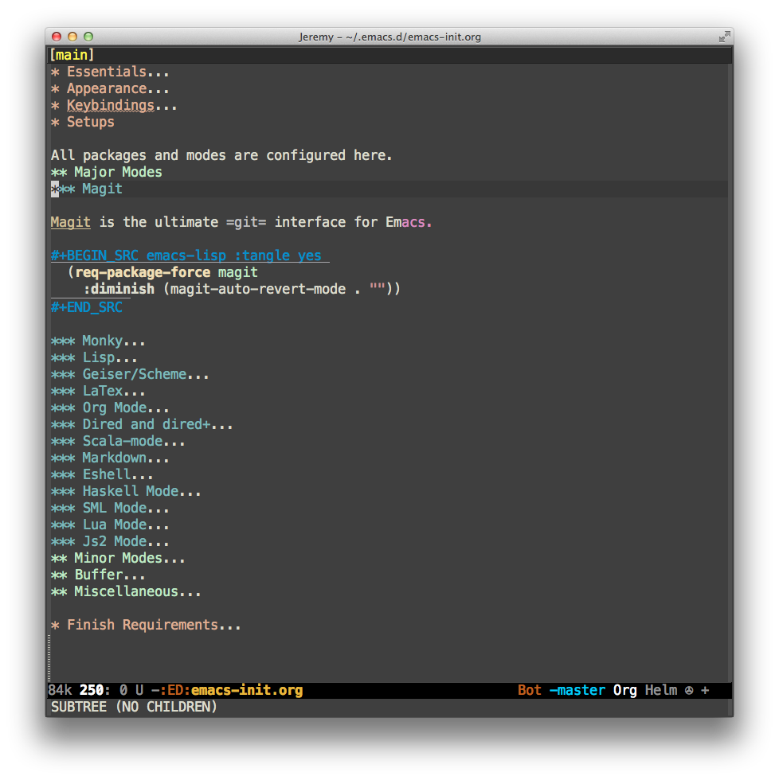

I moved to [doom-emacs](https://github.com/hlissner/doom-emacs).
=================

# Prerequisites #

[Cask](https://github.com/cask/cask)


# Setup #

Be sure to backup your old `.emacs.d` before execute the following

```sh
git clone https://github.com/bixuanzju/emacs.d.git ~/.emacs.d
cd .emacs.d
```

Then fetch the dependencies:

```sh
git submodule update --init --recursive
cask install
```

Open Emacs and enjoy!

# More Info #

See [this](./emacs-init.org) file for more information.


